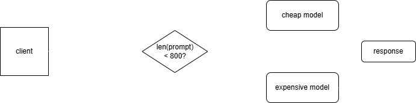

# SmartLLMRouter

A tiny Go proxy that sits between your app and the big LLM APIs. It looks at how long your prompt is and picks the right model automatically — cheap and fast for short stuff, heavy-duty for when you actually need it. Your client never has to change a thing.

## How it works



The client sends a standard OpenAI `chat/completions` request. The router checks `len(prompt) < 800?` and routes accordingly:

- **Under 800 chars** → cheap model. Request gets converted, fired off, response wrapped back into OpenAI format.
- **800+ chars** → expensive model. Raw body proxied straight through, barely touched.

Either way, the client gets back a clean response and has no idea what happened behind the scenes.

## Project structure

```
SmartLLMRouter/
├── main.go           # starts the server, that's basically it
├── config.json       # your keys & settings (don't commit this)
├── config/
│   └── config.go     # reads config.json, sets sensible defaults
└── router/
    └── router.go     # all the actual logic lives here
```

## Setup

**1. Get your API keys**
- OpenAI key from [platform.openai.com](https://platform.openai.com/api-keys)
- Gemini key from [aistudio.google.com](https://aistudio.google.com/app/apikey) (free tier is fine)

**2. Create your config file**
```bash
cp config.json.example config.json
```

Then fill in `config.json`:
```json
{
  "openai_key": "",
  "gemini_key": "",
  "prompt_threshold": 800,
  "cheap_model": "gemini-1.5-flash",
  "expensive_model": "gpt-4o"
}
```

| Field | Default | What it does |
|---|---|---|
| `openai_key` | — | Your OpenAI API key |
| `gemini_key` | — | Your Google AI Studio key |
| `prompt_threshold` | `800` | Prompts shorter than this (in chars) go to the cheap model |
| `cheap_model` | `gemini-1.5-flash` | Model to use for short prompts |
| `expensive_model` | `gpt-4o` | Model to use for long prompts |

**3. Run it**
```bash
go run .
```

Or build a binary if you want:
```bash
go build -o smartllmrouter .
./smartllmrouter
```

Starts on `:8080`.

## Usage

Just point your app at `http://localhost:8080` instead of OpenAI. No other changes needed.

```bash
# short prompt --> cheap model
curl http://localhost:8080/v1/chat/completions \
  -H "Content-Type: application/json" \
  -d '{"model":"gpt-4o","messages":[{"role":"user","content":"hi"}]}'
```

Works with the OpenAI Python client too:
```python
from openai import OpenAI

client = OpenAI(
    api_key="anything",  # router handles the real auth
    base_url="http://localhost:8080/v1"
)

resp = client.chat.completions.create(
    model="gpt-4o",
    messages=[{"role": "user", "content": "explain quantum entanglement in detail..."}]
)
print(resp.choices[0].message.content)
```

## Health check

```bash
curl http://localhost:8080/health
# ok
```

## Requirements

- Go 1.22+
- OpenAI API key
- Google AI Studio key
